# ter-homeworks-02

## Задание 1

Ошибки:
-
Платформа standart-v4 не найдена:

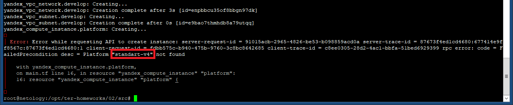

Существуют следуюшие стандартные платформы:

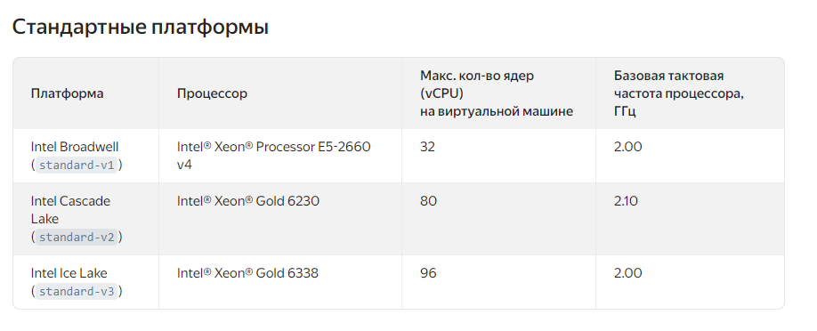

Далее используем "standard-v3".

Процент (доля) использования CPU (для выбранной платформы standard-v3) может иметь значения: 20, 50 или 100:

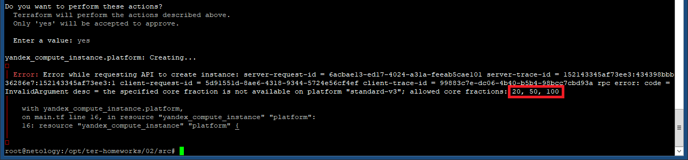

Далее используем "20".

Количество используемых CPU cores (для выбранной платформы standard-v3) может иметь значения: 2 или 4:

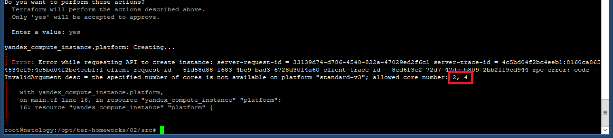

Далее используем "2".

Результат:

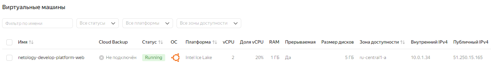

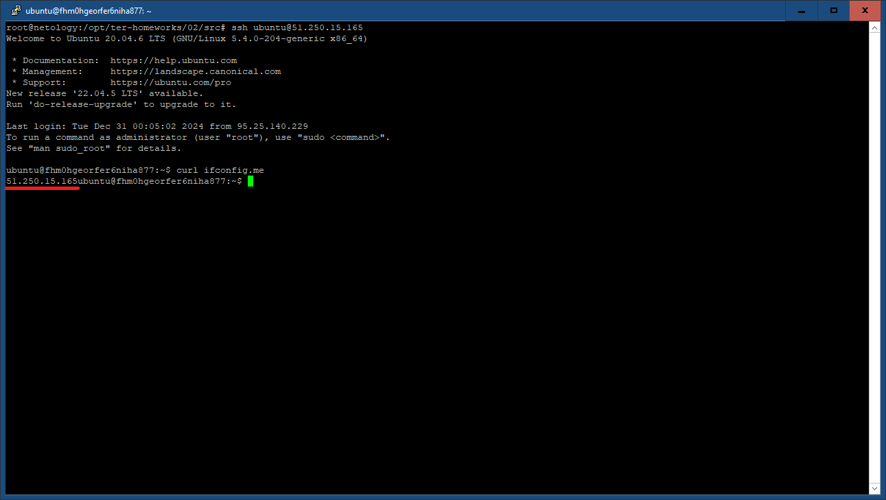

Параметры preemptible = true (прерываемая ВМ) и core_fraction=5 (минимальный процент использование CPU) позволят снизить затраты 
на содержание виртуальных машин на этапах разработки и тестирования.

## Задание 2

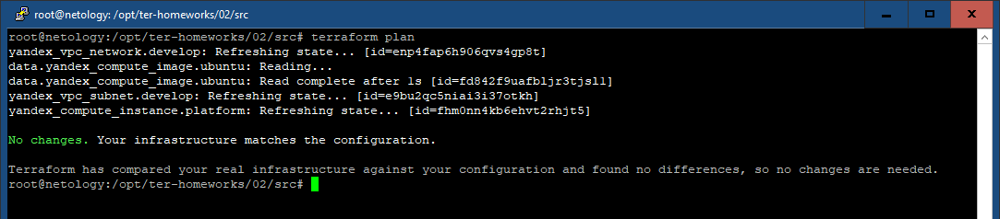

## Задание 3

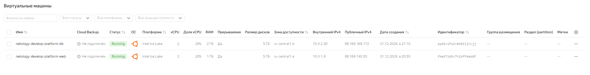

## Задание 4

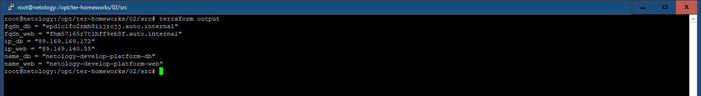

## Задание 5

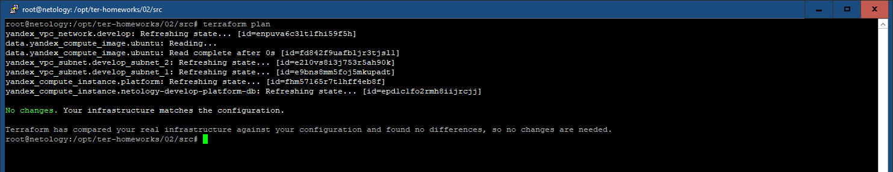

## Задание 6

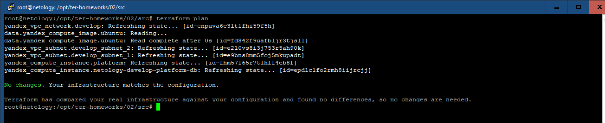

## Задание 7*

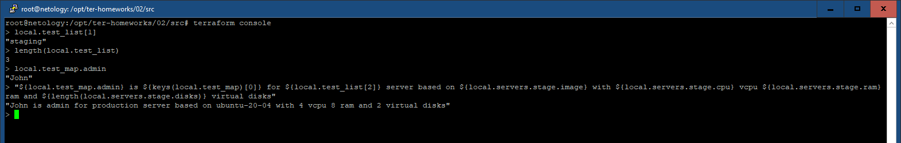

## Задание 8*

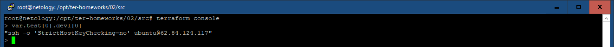

## Задание 9*

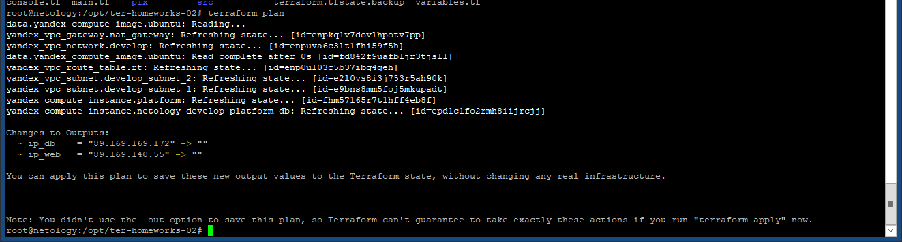

